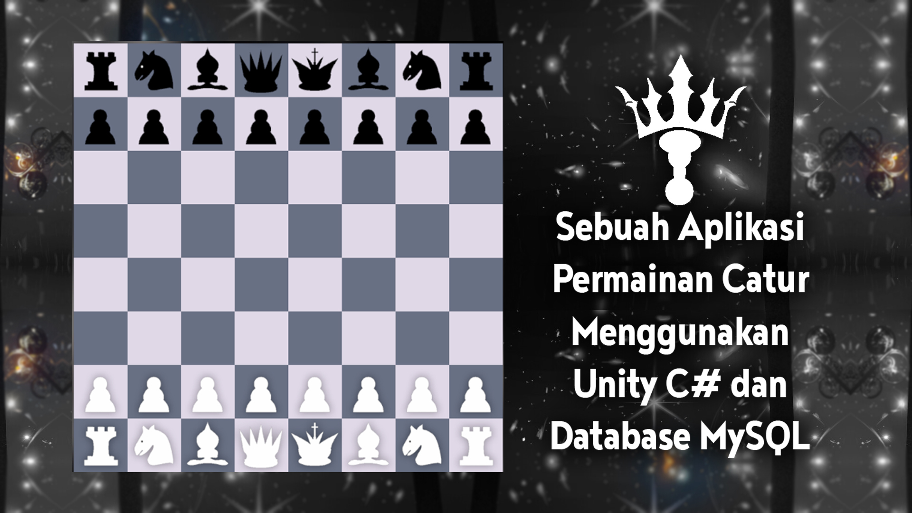

# CATUR 66
Sebuah aplikasi permainan catur 2D yang dibuat dalam Unity Engine 2022.3 LTS\
Features:
- AI Difficulty
- Bullet, Blitz, Rapid, No Time Limit
- CRUD Database (Login, register, leaderboard, etc)
- Save/Load Unfinished Game

# INFORMASI PENTING
Untuk menjalankan aplikasi, harus download file database pada link github berikut:\
[Catur 66 Database Github Repository](https://github.com/iya777/catur666-database)

# REQUIREMENTS
- Unity Engine 2022.3 LTS (minimum)
- MAMP (Recommended) / XAMPP
- Visual Studio IDE / Visual Studio Code

# INSTALLATION
1. Download project Catur 66 dari repository github ini (Bisa juga melalui clone repository menggunakan aplikasi Github Desktop).
2. Download [Catur 66 Database Github Repository](https://github.com/iya777/catur666-database) (Bisa juga melalui clone repository menggunakan aplikasi Github Desktop).
3. Extract project Catur 66 ke suatu lokasi.
4. Extract database Catur 66 ke suatu lokasi yang berbeda dari project Catur 66.
5. Buka folder "Database (Newest Version)" lalu copy folder "sqlconnect".
6. Buka folder htdocs pada MAMP (Lokasi: "C:\MAMP\htdocs") dan paste folder "sqlconnect".
7. Ubah port Apache pada MAMP menjadi 80.
8. Ubah port Nginx pada MAMP menjadi 80.
9. Ubah port MySQL pada MAMP menjadi 3306.
10. Buka phpMyAdmin dari MAMP lalu lakukan import file sql bernama "unityaccess.sql" yang terletak pada folder "Database (Newest Version)" .
11. Buka project Catur 66 menggunakan Unity Engine.
12. Pada project unity, buka folder bernama "Scenes".
13. Tekan dua kali (load) pada scene bernama "SIGN_IN".
14. Tekan play mode pada unity.
15. Log In dengan username = "player" dan password = "player".
